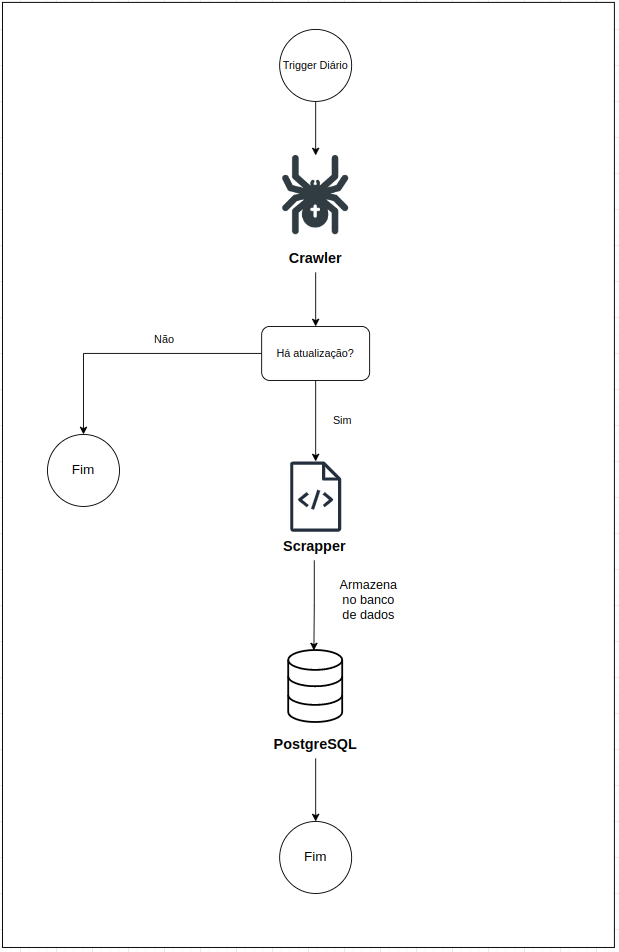

# ETL (Extract Transform Load)
## Apresentação
Este módulo tem como finalidade extrair os dados de pescados de diferentes fontes disponíveis para consulta.
Além de automatizar a extração dos dados, é realizado o processamento e transformações necessárias para o armazenamento dessas informações no banco de dados.
O ETL foi desenhado para ser executado todos os dias para verificar em cada fonte se há informações novas para serem coletadas.

## Main
O arquivo *main.py* coordena a chamada de todos os processos que devem ser executados.
**O projeto está organizado por fonte de dados**, portanto, quando uma nova fonte é incluída, a mesma deve ser chamada neste arquivo para que ela possa ser executada!

Atualmente há apenas uma fonte, [pesagro](https://www.pesagro.rj.gov.br/node/194).

## Crawlers
Os crawlers são módulos responsáveis por analisar fonte de dados coletando informações relevantes sobre os dados a serem extraídos. 
Ele é importante para determinar quais dados devem ser coletados e quais já estão disponíveis no banco.
Atualmente, ele é responsável por chamar o scrapper, receber os novos dados (caso existam) e chamar o módulo de armazenamento no banco de dados.
Informações mais detalhadas podem ser encontradas dentro do diretório crawlers.

## Scrappers
Uma vez que o crawler determinar quais informações devem ser coletadas, o scrapper é acionado para fazer essa raspagem e tranformação do que foi obtido.
Ete tem como principal função conter a implementação que não apenas colete os dados relevantes aos pescados, mas também as regras de negócio que adequem as informações para o "Data-Lake".
Informações mais detalhadas podem ser encontradas dentro do diretório scrappers.

## Módulos Adicionais
Há no projeto alguns módulos customizados para facilitar e abstrair a interação com o sistema de arquivos e a interação com o banco de dados.

#### file_utils.py
Este módulo contém toda a implementação que lida com a interação com o sistema de arquivos. 
Tarefas repetitivas como download, criação, remoção e movimentação de arquivos estão centralizadas neste script.

#### db_utils.py
Este módulo contém toda a lógica de interação e conexão com o banco de dados PostgreSQL. 
Tarefas de conexão, leitura e armazenamento de dados estão centralizadas nesse arquivo.

# Arquitetura geral de ETL
Nesta sessão é apresentado o diagrama mostrando o fluxo geral de dados dentro do processo de ETL.


# Execução
Para a execução do ETL é recomendado o armazenamento dos logs de processamento.
Para isso, a maneira mais versátil e eficiente é rodar o comando:
```
python3 main.py > output_log.txt
```